# expirement

> **说明**：本仓库是 **学习与交流用** 的示例工程，**不是**正式对外产品，不承诺功能完整性、稳定性或长期维护；演示站点与接口仅供体验，请勿用于生产或承载关键业务。

**在线体验**：[https://ooagnt.com/](https://ooagnt.com/)（智能会话工作台）

这是一个整合 **Spring Boot 3** 与 **Spring AI 1.1.2** 后端（Spring AI **1.1.x** 较新主线）与 **Vue 3 + Vite** 前端的学习型全栈示例：用统一门户把多种对话类能力放在一起，便于对照代码理解「多会话、流式回复、知识库、工具调用」等常见模式。数据层使用 PostgreSQL，并提供 Docker Compose 便于本地一键拉起。

---

## 功能介绍

门户首页以卡片形式展示下列能力，点击下方配图可浏览界面效果。

### 1. 智能聊天

**多模态对话**：在文字输入之外，支持为单条消息附加 **图片**（常见图片类型）、**音频**（如 MP3、WAV、M4A 等）以及 **文档与办公文件**（如 PDF、TXT、Markdown，以及 Word、Excel、PowerPoint 等），由模型结合附件内容理解与回复；历史记录中可回看图片预览、音视频播放与文件信息。

在此基础上，仍支持多会话管理、历史消息浏览、流式输出与 Markdown 渲染。

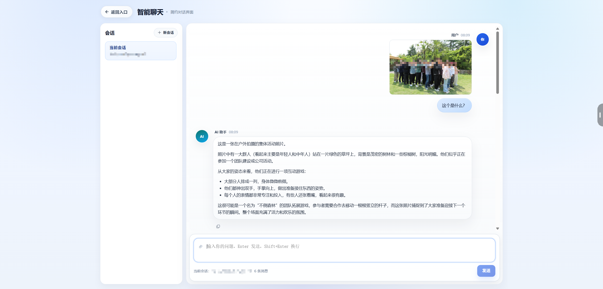

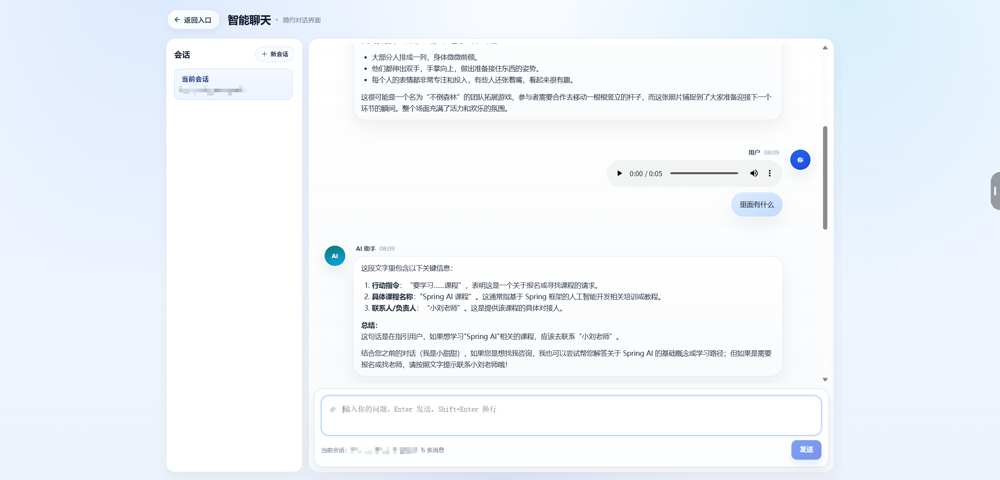

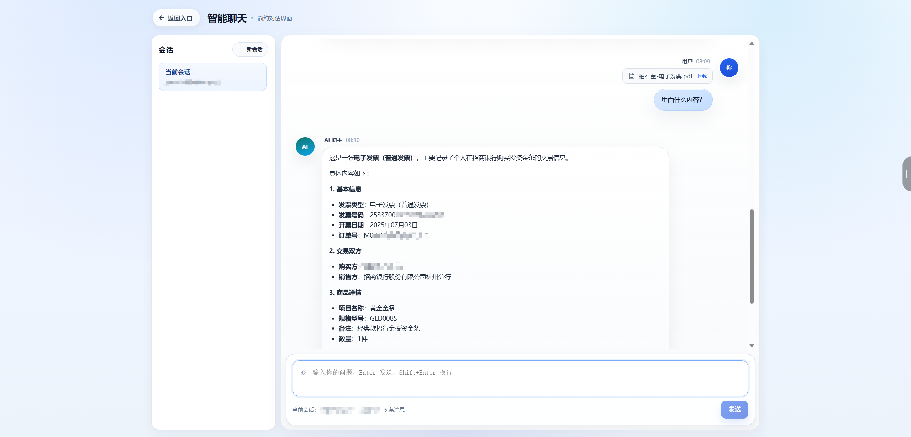

---

### 2. 哄哄模拟器

恋爱主题趣味玩法：先填写「女友生气原因」再开局，在对话中完成哄人模拟，体验连续多轮对话与即时回复。

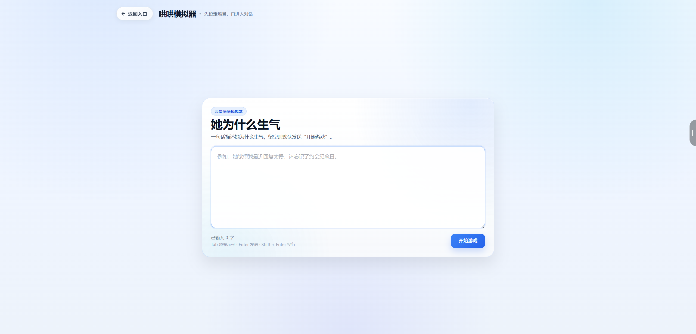

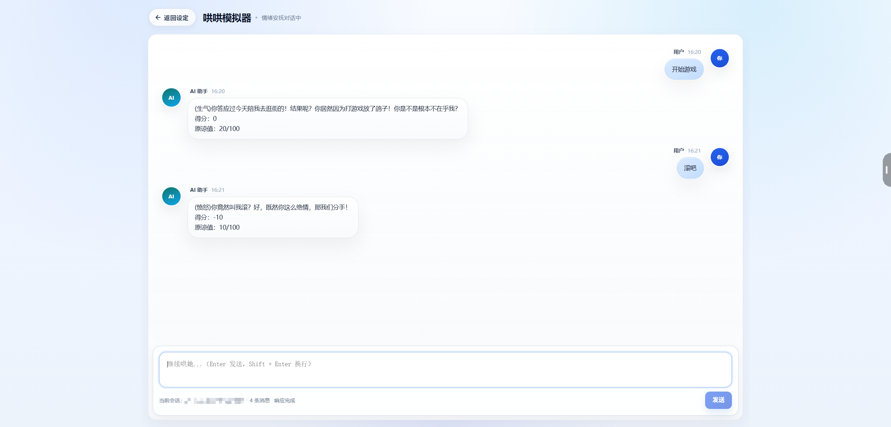

---

### 3. 知识问答

在会话中维护知识库、上传文档，并基于语义理解进行问答，答案可结合所上传内容组织与呈现。

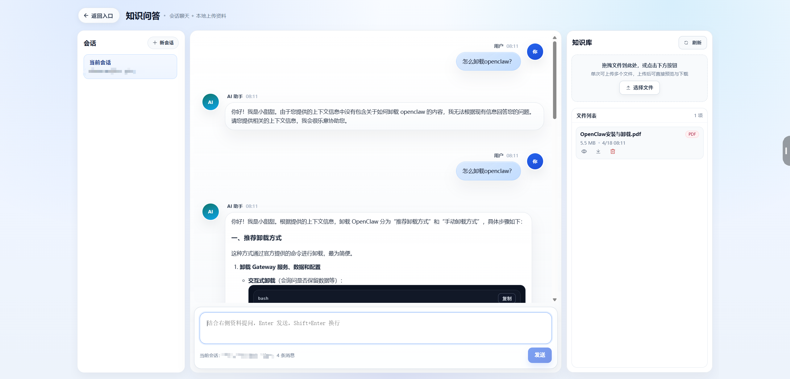

---

### 4. 智能客服（Function Calling / 工具调用）

本能力重点演示 **Function Calling（函数调用）**：由大模型在对话过程中 **自主决定是否、何时调用** 后端预先注册的 **业务工具（Tool）**，把自然语言意图转成 **结构化工具入参**，执行查询、推荐、预约等动作后再将结果融入回复，形成「**对话 → 工具调用 → 再对话**」的闭环。

以聊天方式咨询与办理业务，演示在对话中完成查询、推荐与预约等动作；界面为 **示例场景**（教育类业务演示），便于理解会话式服务形态。

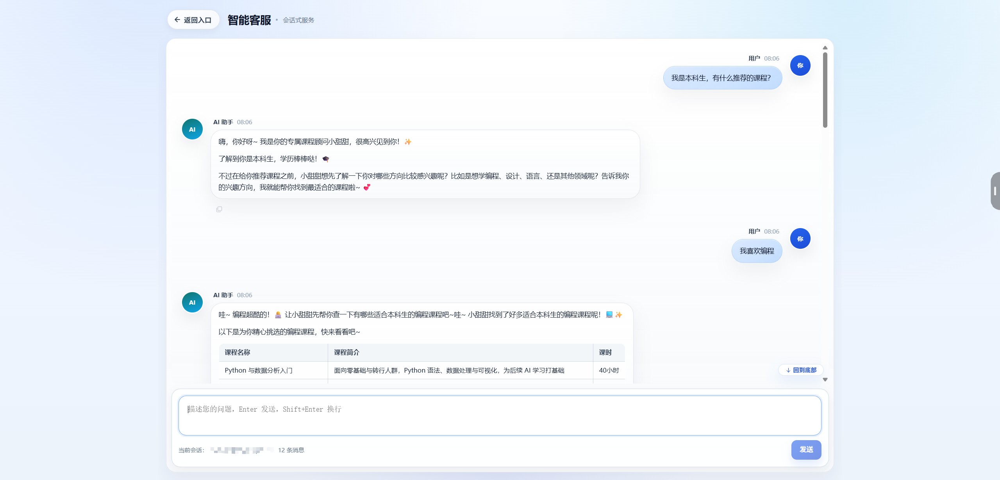

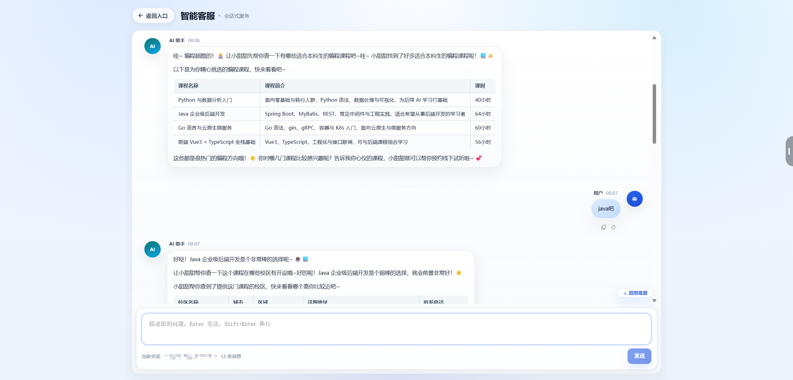

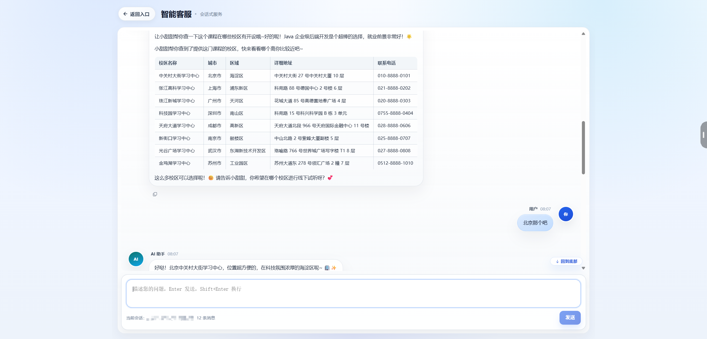

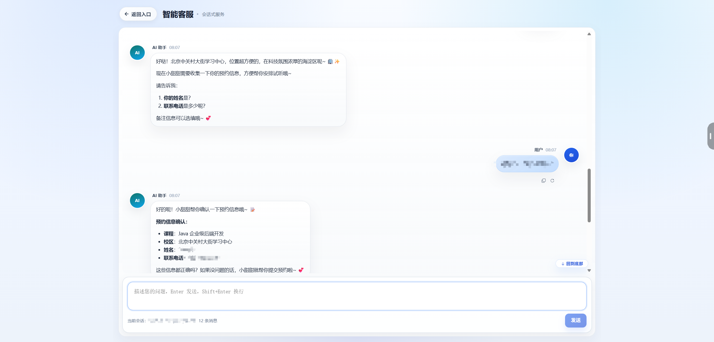

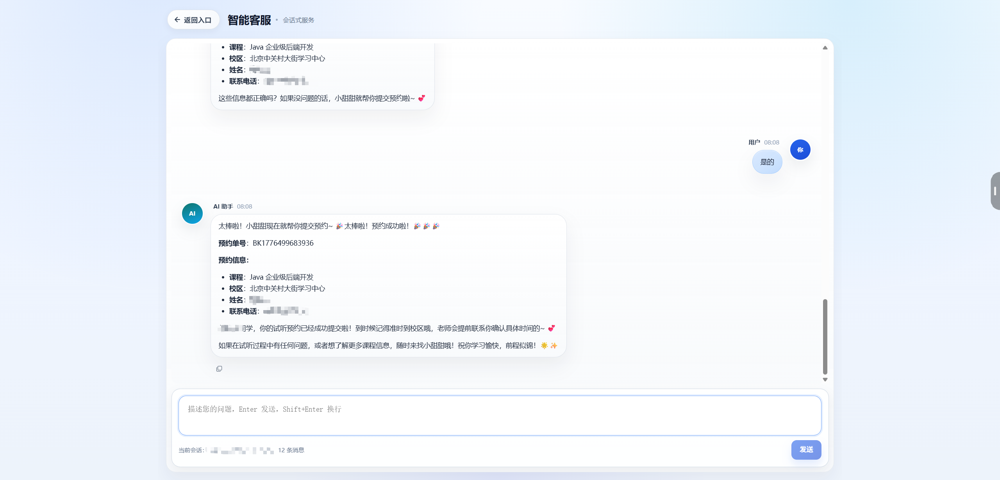

---

## 技术概览（便于对照源码）

| 层级 | 技术 |
| --- | --- |
| 前端 | Vue 3、TypeScript、Vite、Element Plus、Vue Router |
| 后端 | Java 17、Spring Boot 3、**Spring AI 1.1.2**、MyBatis-Plus、Flyway |
| 数据 | PostgreSQL |
| 部署 | Docker、Nginx |

更细的端口、环境变量与部署步骤见 [DEPLOY.md](./DEPLOY.md)。

## 本地一键运行（Docker）

需已安装 Docker 与 Docker Compose v2。

```bash
cp .env.example .env
# 编辑 .env，填写大模型 API Key 等
docker compose up -d --build
```

浏览器访问：`http://localhost`（默认门户端口见 `.env.example`）。Windows 可将 `cp` 换成 `copy .env.example .env`。

## 本地开发（可选）

不使用 Docker 时，需自行安装 **PostgreSQL** 并保证库配置与项目一致，然后分别启动后端与前端：

```bash
cd spring-ai-demo && mvn spring-boot:run
```

```bash
cd portal-frontend && npm ci && npm run dev
```

前端开发地址一般为 `http://localhost:5173`。部署、端口与环境变量见 [DEPLOY.md](./DEPLOY.md)。

## 许可证

若仓库内未另行声明，以各依赖库许可证为准；如需对外分发，请自行补充根目录 `LICENSE`。
